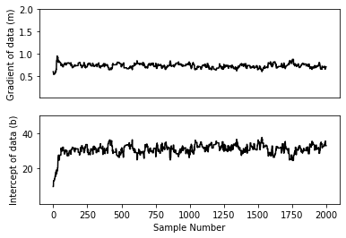
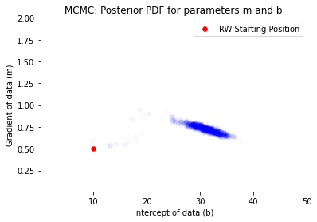
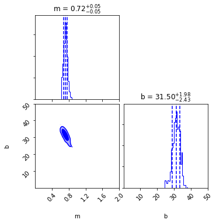
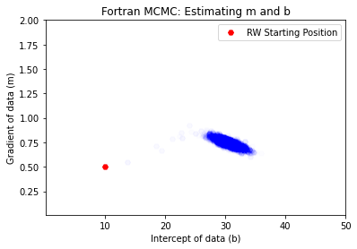
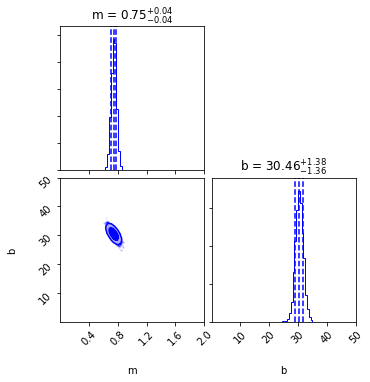

# BayesInferF

This repo contains a proof of concept for Bayesian Inference in Python elaborated using both NumPy and a Fortran 95 engine to perform data generation and Markov Chain Monte Carlo (MCMC) simulation. 

### Dependencies

```
pip3 install numpy pandas matplotlib corner
```

### The Data
The notebook generates a linear relationship between 2 variables `x` and `y` with a certain degree of uncertainty, given two input parameters `m` (gradient) and `b` (y-intercept).

### The Procedure
Assuming a log-uniform distribution for the possible parameters `m` and `b` and a log-gaussian distribution for the likelihood of a value generated by these parameters, an MCMC random walk is performed using the Metropolis algorithm in order to maximise said likelihood and estimate `m` and `b`: this will allow us to visualize the posterior probability density function (PDF) for the two parameters. 

An initial guess for the parameters is given as well as a step size for the variation of the parameters.

### Results

#### Pure Python + Numpy
The random walk quickly equilibrates variable to oscillate around an estimate.




The estimates are extracted using the `corner` package:




The estimates are incredibly accurate as m = 0.72 plus-minus 0.05, compared to a true value of m = 0.736; and b = 31.50 (+1.98, -2.43), compared to a true value of b=30. Both are with estimated error range.

#### Using the Fortran Engine
Similar results are obtained using the Fortran Engine:



